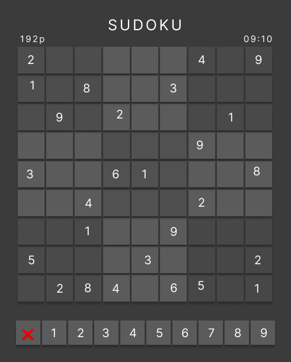

# Sudoku

### Todo-list:

- [ ] Fetch random sudoku from API OR generate it
  - [ ] Fetch or generate
  - [ ] Make into Sudoku-board, with all values
  - [ ] Make a bot to solve the random sudoku
- [ ] Number buttons to set the number you want to add
- [ ] Different color-themes
- [ ] Make use of different game-states
  - [ ] Draw UI in `View.java`
  - [ ] Integrate in `ControllableModel.java`
- [ ] Add timer and score
- [ ] Save scores

### Goal:

